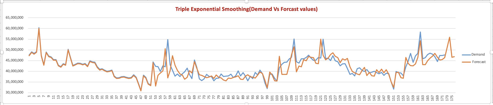

# 🥑 Avocado Sales Demand Forecasting Project (U.S. Market)

This project focuses on forecasting **avocado sales demand in the United States** using advanced **time series analysis** techniques. The objective is to analyze historical sales data and apply the **Triple Exponential Smoothing (Holt-Winters)** method in **Microsoft Excel** to predict future demand trends. This forecasting model helps understand seasonal variations and aids in strategic decision-making for inventory and supply chain management.

---

## 🚀 Key Objectives
- Analyze historical **avocado sales** data in the U.S. market.  
- Apply **Triple Exponential Smoothing** to forecast future sales demand.  
- Interpret seasonal trends and demand patterns to enhance inventory and business decisions.

---

## ⚙️ Project Workflow
1. **Data Preparation**  
   - Collected and cleaned **U.S. avocado sales data** for model input.  
   - Identified key variables affecting sales trends, including seasonality and demand fluctuations.

2. **Modeling Technique**  
   - **Triple Exponential Smoothing (Holt-Winters)**: Used to capture trends and seasonal variations for more accurate sales forecasting.

3. **Analysis and Interpretation**  
   - Generated forecasting results and evaluated model performance.  
   - Visualized outcomes to understand trends and patterns in avocado demand.  
   - Provided strategic recommendations based on forecasted demand insights.

---

## 📈 Key Results
- Developed accurate forecasts for **avocado sales demand** in the U.S. using the **Triple Exponential Smoothing** method.  
- Identified seasonal trends and demand patterns, providing actionable insights for supply chain planning.  
- Recommended strategic actions for inventory management and demand forecasting.

Here is the forecast chart for avocado sales:
## 📊 Forecast Visualization

Here is the forecast chart for avocado sales:

---

## 🛠️ Tools Used
- **Microsoft Excel** for data preparation, forecasting analysis, and visualization.

---

## ✅ Next Steps
- Integrate advanced Python models (like `Prophet` or `statsmodels`) to enhance forecasting accuracy.  
- Automate data analysis workflows for better scalability and efficiency.  
- Validate forecasts with additional market data to refine predictions further.

---

This project serves as a comprehensive analysis of avocado sales trends, providing key insights for strategic planning and demand management in the U.S. avocado market. 🌿
